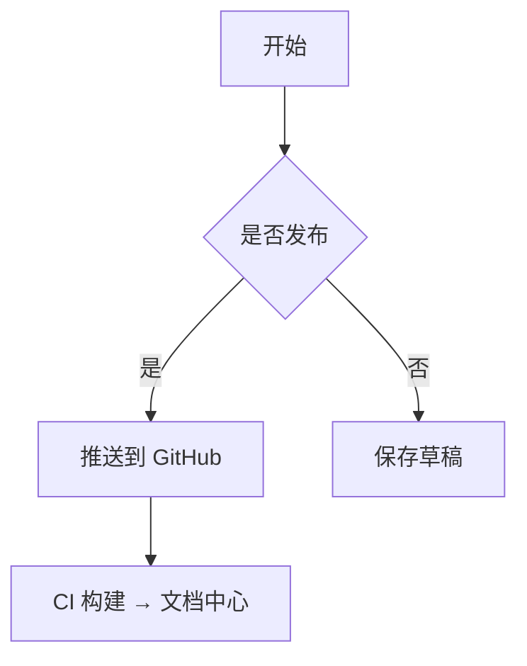

---
# ════════════════════════════════════════════════════════════════
# 📝 文档模板 (docs/_templates/document.md)
#
# 使用本模板:只需 3 步即可开始写正文(约 1 分钟)
#   1. title        → 填文档标题
#   2. categories   → 填 1~N 个分类(归档/文档中心按此分组)
#   3. description  → 填一句话简介(文档中心卡片显示)
#   之后直接开始写正文即可;tags / status 可写可不写。
#
# push 前唯一必改:
#   date 由 dataview 表达式改成真实日期(如 "2026-08-13")。
#   dataview 表达式 CI 无法解析,Calendar 也无法在日历上定位。
#
# ⛔ 千万不要写 layout / permalink —— CI 自动注入,写了会 404!
#    案例: 2026-08-13 documents.md 因手写 permalink 访问 404。
# ════════════════════════════════════════════════════════════════

# ── 必填(开始写正文前) ──
title: ""
description: ""
categories:          # 分类:可多个,归档与文档中心按此分组
  - 分类A            # ← 改成你的分类(如: 技术 / 指南 / 生活)
  # - 分类B          # 需要多分类时取消注释再写一行

# ── 可选(按需填写) ──
tags:                # 标签:文档中心与详情页展示,支持搜索
  - 标签1
status: 草稿         # 文档状态: 草稿 / 完成 / 已发布 / 待更新
# toc: false         # 目录默认自动生成(正文含 ## 标题即显示), 本篇不想要才取消注释

# ── 插件自动生成,创建文档后无需改动 ──
date: "=dateformat(date(today), 'yyyy-MM-dd')"          # Calendar 插件据此在日历定位(创建时是今天)
dateTime: "=dateformat(date(now), 'yyyy-MM-dd HH:mm')"  # Dataview 显示精确创建时间
---

<!-- 页面标题由 frontmatter 的 title 自动生成, 正文无需再写 # 大标题 -->

<!-- 信息栏:Obsidian 阅读模式下自动渲染(Dataview 插件) -->
> [!info] 文档信息
> - 📅 创建日期：`=dateformat(this.date, 'yyyy-MM-dd')`
> - 🕐 创建时间：`=dateformat(this.dateTime, 'HH:mm')`
> - 🗂️ 分类：`=this.categories`
> - 🏷️ 标签：`=this.tags`
> - 📌 状态：`=this.status`

## 简介

<!-- 用 1-2 句话概述本文内容, 便于文档中心检索 -->

## 正文

<!-- 在此开始写作, 按需使用下方小节 -->

### 背景

### 方法 / 步骤

### 结论

## 代码示例

```js
// 示例代码块, 按需替换语言
console.log('Hello Knowledge Docs');
```

## 表格示例

| 项目 | 说明 | 备注 |
| ---- | ---- | ---- |
|      |      |      |

## 公式示例

$$
E = mc^2
$$

## 流程图示例 (Mermaid)



## 总结

- 要点 1
- 要点 2

## 参考资料

- [链接标题](url)

---

<!-- ════════ 发布前检查清单(push 前过一遍) ════════
[ ] 1. date 已改为真实日期字符串(去掉 dataview 表达式)
[ ] 2. 已删除正文残留的 [[wikilink]] 占位与示例代码块
[ ] 3. categories 是真实分类,tags 已清理(或留空)
[ ] 4. frontmatter 中没有手写 layout / permalink(写了会 404)
[ ] 5. 文件位于 docs/knowledge-docs/ 下,推送后访问 URL 与文件名一致
════════ -->
