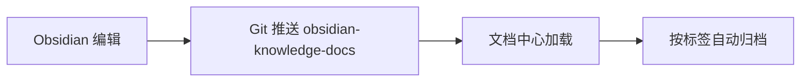

---
# ⚠️ 请勿手写 layout / permalink 这两个字段！
# 文档 push 到 GitHub 后,CI (gen-docs-index.js) 会自动注入:
#   layout: doc       → 让 Jekyll 把 .md 渲染成完整 HTML 页面
#   permalink: /.../  → 让 URL 带尾斜杠,与文档中心跳转保持一致
# 如果你在 Obsidian 里手写了其中任一字段,CI 会跳过注入。(一般不推荐写)

title: "文档标题(必填)"
date: {{date:YYYY-MM-DD}}
description: "一句话描述文档内容,用于文档中心卡片展示"
# 👆 以上模板变量请在 Obsidian (Templater/nldates 插件) 中会自动替换
#
# 📌 以下字段已填充了示例值,你需要按文档内容手动修改
category: 技术
# 可选分类: 技术 / 生活 / 工作 / 学习 / 项目 / 随笔
tags:
  - 标签A
  - 标签B
# ✅ 每个文档支持多个标签,文档中心会按标签自动归档
#    新标签会自动创建归档分组,已有标签直接归入已有分组
#    不想被归档就把这行和上面两行删掉
author: Stam
# 作者,与 _config.yml 中 author.name 保持一致
---

# {{title}}

> [!info] 发布流程
> 1. 在 Obsidian 中通过 Templater 插件基于本模板创建新笔记
> 2. 保存到本仓库的 `docs/knowledge-docs/` 目录
> 3. Push 到 GitHub → CI 自动生成索引 → 文档中心展示 ✅
> - **已有标签** → 文档直接归入该标签分组
> - **新标签** → 自动创建一个新的标签分组
> - 一个文档可以有多个标签,会同时出现在多个分组中
> - 没有填 tags 的文档会归入「未分类」

## 概述

在这里用 2-3 句话说明本文档要解决的问题或分享的内容。

## 核心内容

### 一级标题:主题

正文段落,支持 Markdown 标准语法与 Obsidian 特有语法:

- **粗体**、*斜体*、`行内代码`
- [[Obsidian 模板|双向链接]] 到其他笔记
- 任务列表
  - [x] 已完成事项
  - [ ] 待办事项

### 代码示例

```go
package main

import "fmt"

func main() {
    fmt.Println("Hello, Share of Stam!")
}
```

### 表格

| 列 1 | 列 2 | 列 3 |
|------|------|------|
| A    | B    | C    |
| 1    | 2    | 3    |

### 数学公式 (可选)

$$
E = mc^2
$$

行内公式: $\sum_{i=1}^{n} i = \frac{n(n+1)}{2}$

### 流程图 (可选)



## 关键点总结

1. 核心要点 1
2. 核心要点 2
3. 核心要点 3

## 参考

- [Obsidian 官方文档](https://help.obsidian.md/)
- [Jekyll Frontmatter](https://jekyllrb.com/docs/front-matter/)

---

> **发布流程**
> 1. 在 Obsidian 中编辑本文档（推荐使用 Templater 插件）
> 2. 提交到 `stan-fuls/obsidian-knowledge-docs` 仓库
> 3. 文档中心自动按标签归档展示 ✅
