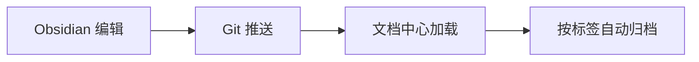

# {{title}}

> [!NOTE] <!--easygit-callout:original=info,collapse=--> 文档信息（Obsidian 内由 dataview 自动生成，无需手改）
> - 📅 创建日期：`=dateformat(date(this.date), 'yyyy-MM-dd')`
> - 🕐 创建时间：`=dateformat(date(this.dateTime), 'yyyy-MM-dd HH:mm')`
> - 📂 分类：`=this.category` ｜ 🏷️ 标签：`=this.tags`
> - 🚦 状态：`=this.status`
>
> 提示：若上面显示空白，请确认已安装并启用 **Dataview** 插件；`date` 字段改成真实日期后，Calendar 插件会在日历上定位本文档。

> [!NOTE] <!--easygit-callout:original=abstract,collapse=--> 发布流程
> 1. 在 Obsidian 中通过 Templater 插件基于本模板创建新笔记
> 2. 完成写作，把 `date` 改为真实日期，确认 `category` / `tags`
> 3. 保存到本仓库的 `docs/knowledge-docs/<主题>/` 目录
> 4. Push 到 GitHub → CI 自动生成索引 → 文档中心展示 ✅
> - **已有标签** → 文档直接归入该标签分组
> - **新标签** → 自动创建一个新的标签分组
> - 一个文档可以有多个标签，会同时出现在多个分组中
> - 没有填 tags 的文档会归入「未分类」

## 概述

在这里用 2-3 句话说明本文档要解决的问题或分享的内容。

## 核心内容

### 一级标题：主题

正文段落，支持 Markdown 标准语法与 Obsidian 特有语法：

- **粗体**、*斜体*、`行内代码`
- [[Obsidian 模板|双向链接]] 到其他笔记
- 任务列表
  - [x] 已完成事项
  - [ ] 待办事项

### 代码示例

```go
package main

import "fmt"

func main() {
    fmt.Println("Hello, Share of Stam!")
}
```

### 表格

| 列 1 | 列 2 | 列 3 |
|------|------|------|
| A    | B    | C    |
| 1    | 2    | 3    |

### 数学公式 (可选)

$$
E = mc^2
$$

行内公式：$\sum_{i=1}^{n} i = \frac{n(n+1)}{2}$

### 流程图 (可选)



## 关键点总结

1. 核心要点 1
2. 核心要点 2
3. 核心要点 3

## 参考

- [Obsidian 官方文档](https://help.obsidian.md/)
- [Jekyll Frontmatter](https://jekyllrb.com/docs/front-matter/)

---

> **发布前检查清单**
> - [ ] `title` / `description` 已填写
> - [ ] `date` 已改为真实日期（push 前必须）
> - [ ] `category` 为已有分类
> - [ ] `tags` 已确认（可留空删除）
> - [ ] 已保存到 `docs/knowledge-docs/<主题>/`
> - [ ] 已执行 `git add` → `git commit` → `git push origin master`