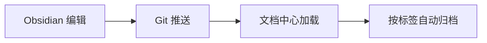

# {{title}}


## 概述

在这里用 2-3 句话说明本文档要解决的问题或分享的内容。[[123]]

## 核心内容

### 一级标题：主题

正文段落，支持 Markdown 标准语法与 Obsidian 特有语法：

- **粗体**、*斜体*、`行内代码`
- [[Obsidian 模板|双向链接]] 到其他笔记
- 任务列表
  - [x] 已完成事项
  - [ ] 待办事项

### 代码示例

```go
package main

import "fmt"

func main() {
    fmt.Println("Hello, Share of Stam!")
}
```

### 表格

| 列 1 | 列 2 | 列 3 |
|------|------|------|
| A    | B    | C    |
| 1    | 2    | 3    |

### 数学公式 (可选)

$$
E = mc^2
$$

行内公式：$\sum_{i=1}^{n} i = \frac{n(n+1)}{2}$

### 流程图 (可选)



## 关键点总结

1. 核心要点 1
2. 核心要点 2
3. 核心要点 3

## 参考

- [Obsidian 官方文档](https://help.obsidian.md/)
- [Jekyll Frontmatter](https://jekyllrb.com/docs/front-matter/)

---

> **发布前检查清单**
> - [ ] `title` / `description` 已填写
> - [ ] `date` 已改为真实日期（push 前必须）
> - [ ] `category` 为已有分类
> - [ ] `tags` 已确认（可留空删除）
> - [ ] 已保存到 `docs/knowledge-docs/<主题>/`
> - [ ] 已执行 `git add` → `git commit` → `git push origin master`